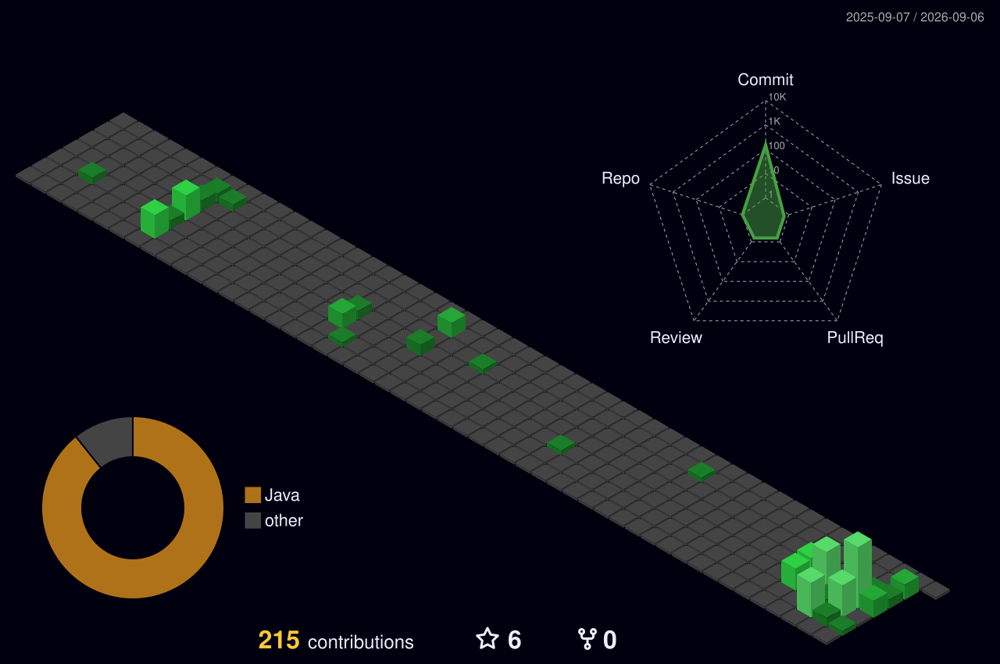

<!--
**HoJungL/HoJungL** is a ✨ _special_ ✨ repository because its README.md (this file) appears on your GitHub profile.
-->

## 필요한 개발자가 되고자 하는 "이호정"입니다.

  
  
  

### 경험
- **헬스케어 데이터 플랫폼 백엔드 개발** : 사용자·관리자 API 및 건강 데이터 처리 기능 개발
- **장례식장 상담 시스템 백엔드 개발 및 배포** : Cloudflare Workers 기반 API 구축, DB 설계 및 배포 환경 구성
- **삼성 청년 SW 아카데미 12기** : 2024.07 ~ 2025.06
- **삼성 청년 SW 아카데미 Mobile 이수 및 1학기 최종 프로젝트 우수상**
- **코딩 자율 학습단 6기** : Java 및 Spring Boot를 활용한 웹사이트 구현
- **Object Detection Project** : 배관 균열 탐색 주제 (2023.09 ~ 2023.11)
- **데이터 분석 동아리 "결초보은"** : 2022.03 ~ 2023.11

### 자격증

- **정보처리기사**
- **빅데이터분석기사**
- **정보처리기능사**
- **SQL개발자(SQLD)**

&nbsp;

### 기술 스택 - Mobile / Frontend

&nbsp;&nbsp;
&nbsp;&nbsp;

### 기술 스택 - Backend

&nbsp;&nbsp;
&nbsp;&nbsp;
&nbsp;&nbsp;

### 기술 스택 - Database / ORM / Cache

&nbsp;&nbsp;
&nbsp;&nbsp;
&nbsp;&nbsp;

### 기술 스택 - Infra / Deployment

&nbsp;&nbsp;

### 기술 스택 - Collaboration / Design

&nbsp;&nbsp;
&nbsp;&nbsp;
&nbsp;&nbsp;

### AI 활용 도구

&nbsp;&nbsp;
&nbsp;&nbsp;
&nbsp;&nbsp;
&nbsp;&nbsp;

&nbsp;

### 활동 및 대표적인 기록

  

<!--
외부 동적 카드 서비스가 중단되어 액박이 발생하므로, 서비스가 복구되면 아래 링크를 다시 사용할 수 있습니다.

-->

### 저의 학습 내용을 기록한 사이트입니다.

